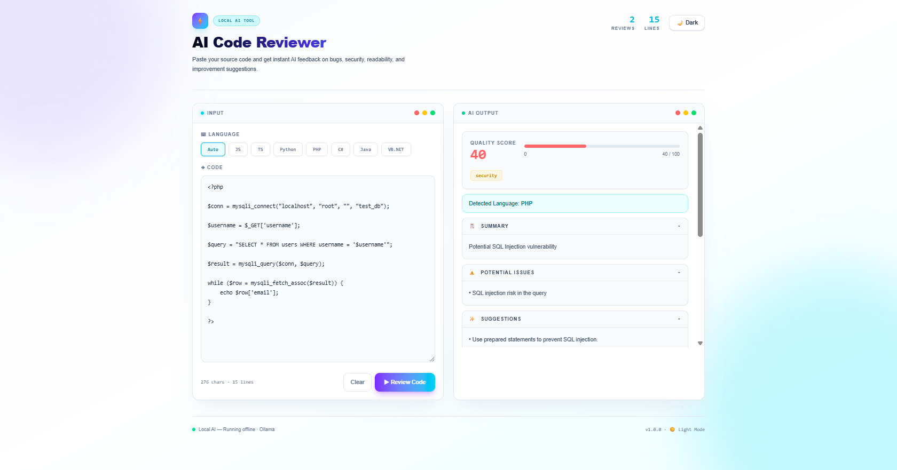

# AI Code Reviewer

AI Code Reviewer is a local AI-powered code review system built with React, Vite, Tailwind CSS, Node.js, Express, TypeScript, and Ollama.

The system allows users to paste source code and receive AI-generated feedback on code quality, possible bugs, security issues, readability, maintainability, and improvement suggestions. The AI model runs locally using Ollama, so submitted code can be reviewed without sending it to an external cloud API.

## Features

- Paste source code for review
- Auto-detect programming language
- Supports JavaScript, TypeScript, Python, PHP, C#, Java, and VB.NET
- AI-generated quality score
- Code review summary
- Potential issue detection
- Improvement suggestions
- Detailed review output
- Dark mode and light mode
- Scrollable AI output panel
- Local AI model using Ollama
- React Vite frontend
- Node.js Express backend

## Tech Stack

- React
- Vite
- TypeScript
- Tailwind CSS
- Node.js
- Express
- Ollama API
- qwen2.5-coder:3b

## Screenshot



## Project Structure

```text
ai-code-reviewer/
├── backend/
│   ├── src/
│   │   └── server.ts
│   ├── package.json
│   └── tsconfig.json
│
├── frontend/
│   ├── public/
│   ├── src/
│   │   ├── components/
│   │   │   ├── Header.tsx
│   │   │   ├── InputPanel.tsx
│   │   │   ├── OutputPanel.tsx
│   │   │   ├── ScoreCard.tsx
│   │   │   └── SectionCard.tsx
│   │   ├── data/
│   │   │   └── languages.ts
│   │   ├── types/
│   │   │   └── review.ts
│   │   ├── utils/
│   │   │   └── reviewParser.ts
│   │   ├── App.tsx
│   │   ├── index.css
│   │   └── main.tsx
│   ├── package.json
│   └── vite.config.ts
│
├── .gitignore
└── README.md
```

## Requirements

Before running this project, install:

- Node.js
- npm
- Git
- Ollama

Recommended hardware:

- 8GB RAM minimum
- 16GB RAM or above for smoother local AI performance
- Enough storage space for Ollama models

## Ollama Setup

Install Ollama on your computer.

Pull the coding model:

```bash
ollama pull qwen2.5-coder:3b
```

Check installed models:

```bash
ollama list
```

Start Ollama:

```bash
ollama serve
```

If Ollama is already running, the terminal may show that the port is already in use. That is normal.

## Optional: Store Ollama Models on Another Drive

Ollama models can take up storage space. To store models on another drive, create a folder such as:

```text
D:\OllamaModels
```

Then set this environment variable on Windows:

```text
OLLAMA_MODELS=D:\OllamaModels
```

After setting the environment variable, restart PowerShell or VS Code terminal, restart Ollama, and pull the model again:

```bash
ollama pull qwen2.5-coder:3b
```

## Installation

Clone the repository:

```bash
git clone https://github.com/YOUR_USERNAME/ai-code-reviewer.git
```

Go into the project folder:

```bash
cd ai-code-reviewer
```

Install backend dependencies:

```bash
cd backend
npm install
```

Install frontend dependencies:

```bash
cd ../frontend
npm install
```

## Running the Project

This project needs three terminals:

1. Ollama
2. Backend
3. Frontend

### Terminal 1: Start Ollama

```bash
ollama serve
```

### Terminal 2: Start Backend

From the project root:

```bash
cd backend
npm run dev
```

The backend will run at:

```text
http://localhost:5000
```

To test the backend, open this URL in your browser:

```text
http://localhost:5000
```

Expected response:

```json
{
  "message": "AI Code Reviewer backend is running"
}
```

### Terminal 3: Start Frontend

From the project root:

```bash
cd frontend
npm run dev
```

The frontend will run at:

```text
http://localhost:5173
```

Open the browser and go to:

```text
http://localhost:5173
```

## How to Use

1. Open the frontend in the browser.
2. Paste source code into the code input box.
3. Select a programming language or use auto-detect.
4. Click **Review Code**.
5. Wait for the local AI model to analyze the code.
6. View the quality score, summary, potential issues, suggestions, and detailed review.

The first review may take longer because the model needs to load into memory.

## Example Code to Test

### JavaScript Example

```javascript
let password = "123456";

function login(userInput) {
  if (userInput == password) {
    console.log("Login success");
  } else {
    console.log("Login failed");
  }
}
```

Expected review may include:

- Hardcoded password
- Weak authentication logic
- Use strict equality `===`
- Missing secure password storage

### PHP Example

```php
<?php

$conn = mysqli_connect("localhost", "root", "", "test_db");

$username = $_GET['username'];

$query = "SELECT * FROM users WHERE username = '$username'";

$result = mysqli_query($conn, $query);

while ($row = mysqli_fetch_assoc($result)) {
    echo $row['email'];
}

?>
```

Expected review may include:

- SQL injection risk
- Direct use of user input
- Missing input validation
- Use prepared statements
- No database connection error handling

## Backend API

Review code endpoint:

```text
POST http://localhost:5000/api/review
```

Request body:

```json
{
  "language": "auto",
  "code": "your source code here"
}
```

Response example:

```json
{
  "review": {
    "detectedLanguage": "JavaScript",
    "score": 50,
    "summary": "The code contains a hardcoded password and weak authentication logic.",
    "issues": [
      "Hardcoded password",
      "Weak authentication logic",
      "Uses loose equality comparison"
    ],
    "suggestions": [
      "Store secrets in environment variables",
      "Use secure authentication and password hashing",
      "Use strict equality comparison"
    ],
    "tags": [
      {
        "label": "security",
        "type": "bad"
      }
    ]
  }
}
```

## GitHub Upload Guide

Make sure you are in the main project folder:

```bash
cd D:\ai-code-reviewer
```

Initialize Git:

```bash
git init
```

Check files:

```bash
git status
```

Add all files:

```bash
git add .
```

Commit the project:

```bash
git commit -m "Initial commit - AI Code Reviewer"
```

Create a new repository on GitHub named:

```text
ai-code-reviewer
```

Do not select:

- Add README
- Add .gitignore
- Add license

Connect your local project to GitHub:

```bash
git branch -M main
git remote add origin https://github.com/YOUR_USERNAME/ai-code-reviewer.git
git push -u origin main
```

Replace `YOUR_USERNAME` with your GitHub username.

Example:

```bash
git remote add origin https://github.com/dearkai311/ai-code-reviewer.git
git push -u origin main
```

## Updating GitHub After Changes

After editing your project, run:

```bash
git status
git add .
git commit -m "Update project"
git push
```

Example for adding review history later:

```bash
git add .
git commit -m "Add review history feature"
git push
```

## Important Git Ignore Notes

Do not upload these to GitHub:

- node_modules
- frontend/node_modules
- backend/node_modules
- dist
- frontend/dist
- backend/dist
- .env files
- Ollama model files
- local model folders

Recommended `.gitignore` content:

```gitignore
# Dependencies
node_modules/
frontend/node_modules/
backend/node_modules/

# Build output
dist/
frontend/dist/
backend/dist/

# Environment files
.env
.env.local
.env.development
.env.production

# Logs
npm-debug.log*
yarn-debug.log*
yarn-error.log*
pnpm-debug.log*

# OS files
.DS_Store
Thumbs.db

# VS Code
.vscode/

# Ollama models should not be uploaded
.ollama/
OllamaModels/
models/

# TypeScript cache
*.tsbuildinfo
```

## Common Commands

Start Ollama:

```bash
ollama serve
```

Pull AI model:

```bash
ollama pull qwen2.5-coder:3b
```

List installed models:

```bash
ollama list
```

Start backend:

```bash
cd backend
npm run dev
```

Start frontend:

```bash
cd frontend
npm run dev
```

Check Git status:

```bash
git status
```

Add changes to Git:

```bash
git add .
```

Commit changes:

```bash
git commit -m "Update project"
```

Push to GitHub:

```bash
git push
```

## Notes

- The AI model runs locally using Ollama.
- Code review quality depends on the selected Ollama model.
- The first review may be slower because the model needs to load into memory.
- Do not upload Ollama model files to GitHub.
- Do not upload `node_modules` to GitHub.
- This project currently runs locally.
- The backend must be running before the frontend can request a review.
- Ollama must be running before the backend can get an AI response.

## Future Improvements

- Save review history
- Upload source code files for review
- Export review result as PDF
- GitHub repository review
- Pull request review
- CodeQL-style security scanning
- User authentication
- Database storage
- Multiple AI model selection
- Review severity labels
- Downloadable review reports

## License

This project is licensed under the MIT License.

You are allowed to use, modify, and distribute this project, but the original copyright notice and author credit must be included.

Designed and developed by Khairulnizam.
